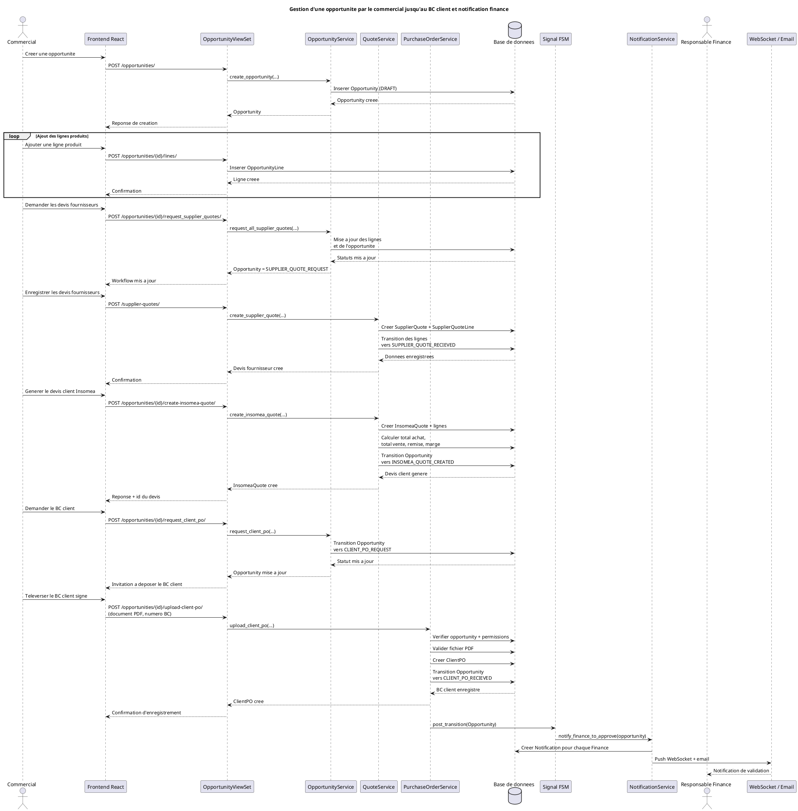

# Chapitre 2 : Specification des besoins et conception generale

## 2.1 Introduction

Ce chapitre presente la specification des besoins et la conception generale du CRM developpe pour la gestion des activites commerciales, financieres et techniques. L'analyse a ete etablie a partir de l'exploration du code source du projet, notamment du module `apps/ventes` du backend Django et des ecrans React du frontend.

L'application met en oeuvre un processus de vente structure autour de l'entite **Opportunity**, qui represente une opportunite commerciale reliee a un client, a un commercial responsable, a des lignes produits, a des devis fournisseur, a un devis client Insomea, a un bon de commande client, puis a des bons de commande fournisseur et a des notifications metier. Le workflow observe dans le code suit principalement les etats suivants : `DRAFT`, `SUPPLIER_QUOTE_REQUEST`, `SUPPLIER_QUOTE_RECIEVED`, `INSOMEA_QUOTE_CREATED`, `CLIENT_PO_REQUEST`, `CLIENT_PO_RECIEVED`, `APPROUVED`, `INSOMEA_POS_SENT` et `INSOMEA_POS_CONFIRMED`.

Dans ce chapitre, nous identifions les acteurs du systeme, nous formulons les besoins fonctionnels et non fonctionnels, puis nous presentons la logique generale du scenario metier dans lequel un commercial gere une opportunite depuis sa creation jusqu'a l'enregistrement du bon de commande client avec notification de l'equipe finance.

## 2.2 Specification des besoins

### 2.2.1 Identification des acteurs

L'etude du code a permis d'identifier les acteurs suivants.

#### Acteurs internes

- **Administrateur** : il dispose d'une vision globale sur l'application, sur les utilisateurs et sur les objets metier. Il peut superviser les donnees et intervenir sur les differents modules.
- **Commercial** : c'est l'acteur principal du processus de vente. Il cree l'opportunite, ajoute les lignes produits, demande les devis fournisseurs, enregistre les devis recus, genere le devis client Insomea, demande le bon de commande client puis depose le bon de commande recu.
- **Responsable Finance** : il intervient a partir de la reception du bon de commande client. Il consulte les opportunites en phase avancee, recoit une notification d'action, approuve l'opportunite et prepare les bons de commande fournisseurs.
- **Technicien** : il intervient apres la phase d'approbation et de commande fournisseur. Il prend en charge les provisions et le provisioning des subscriptions.

#### Acteurs externes

- **Client** : il recoit le devis commercial et transmet son bon de commande au commercial. Il n'accede pas directement a l'application, mais il est un acteur essentiel du flux metier.
- **Fournisseur** : il fournit les devis produits/services demandes par le commercial et recoit ensuite les bons de commande emis par l'entreprise.

### 2.2.2 Besoins fonctionnels

D'apres le code explore, le systeme doit satisfaire les besoins fonctionnels suivants.

#### Gestion des utilisateurs et des acces

- Le systeme doit permettre l'authentification des utilisateurs.
- Le systeme doit gerer des roles differencies : administrateur, commercial, finance et technicien.
- Le systeme doit limiter les actions selon le role et selon la responsabilite sur l'opportunite.

#### Gestion des clients et du catalogue

- Le systeme doit permettre la gestion des fiches clients.
- Le systeme doit permettre la gestion des contacts associes a chaque client.
- Le systeme doit permettre la gestion des produits et des fournisseurs.

#### Gestion des opportunites commerciales

- Le systeme doit permettre au commercial de creer une opportunite pour un client.
- Le systeme doit permettre d'associer un type d'opportunite : vente initiale, renouvellement, upsell ou downgrade.
- Le systeme doit permettre d'affecter l'opportunite a un commercial responsable.
- Le systeme doit permettre d'ajouter des lignes produits a l'opportunite avec quantite et cycle de facturation.
- Le systeme doit gerer automatiquement l'etat de l'opportunite selon l'avancement du workflow.

#### Gestion des devis fournisseurs

- Le systeme doit permettre au commercial de demander les devis fournisseurs pour toutes les lignes d'une opportunite.
- Le systeme doit permettre d'enregistrer un devis fournisseur sous forme de document PDF.
- Le systeme doit permettre d'associer les prix d'achat fournisseurs aux lignes de l'opportunite.
- Le systeme doit faire evoluer les lignes et l'opportunite apres reception de tous les devis fournisseurs.

#### Gestion du devis client Insomea

- Le systeme doit permettre de generer un devis client global a partir des devis fournisseurs.
- Le systeme doit permettre de definir les prix de vente pour chaque ligne.
- Le systeme doit calculer automatiquement les montants d'achat, les montants de vente, la remise et la marge.
- Le systeme doit generer un document PDF du devis client.

#### Gestion du bon de commande client

- Le systeme doit permettre au commercial de demander le bon de commande client apres creation du devis Insomea.
- Le systeme doit permettre de televerser le bon de commande client signe au format PDF.
- Le systeme doit enregistrer le numero du bon de commande client.
- Le systeme doit faire passer automatiquement l'opportunite a l'etat indiquant que le bon de commande client a ete recu.

#### Notification de la finance

- Le systeme doit notifier automatiquement les utilisateurs du role Finance des qu'un bon de commande client est enregistre.
- Le systeme doit enregistrer une notification interne associee a l'opportunite.
- Le systeme doit transmettre cette notification en temps reel via WebSocket.
- Le systeme doit egalement envoyer un email de notification a l'equipe finance.

#### Suite du workflow apres approbation

- Le systeme doit permettre a la finance d'approuver l'opportunite.
- Le systeme doit generer les bons de commande fournisseurs en regroupant les lignes par fournisseur.
- Le systeme doit permettre l'envoi des bons de commande aux fournisseurs.
- Le systeme doit ensuite preparer la phase de provision et de provisioning.

#### Resume du scenario cible de ce chapitre

Le scenario metier central observe dans le code est le suivant :

1. Le commercial cree une opportunite.
2. Il ajoute les lignes produits.
3. Il demande puis enregistre les devis fournisseurs.
4. Il genere le devis client Insomea.
5. Il demande le bon de commande client.
6. Il enregistre le bon de commande client signe.
7. Le systeme notifie automatiquement la finance pour approbation.

### 2.2.3 Besoins non fonctionnels

L'analyse du code a egalement permis d'identifier plusieurs besoins non fonctionnels.

#### Securite

- Le systeme doit securiser l'acces par authentification JWT.
- Le systeme doit garantir le controle d'acces selon les roles et les permissions metier.
- Le systeme doit empecher un utilisateur non autorise de manipuler une opportunite qui ne lui appartient pas ou qui ne releve pas de son perimetre.

#### Integrite et coherence des donnees

- Le systeme doit assurer la coherence du workflow par des transitions d'etat controlees.
- Le systeme doit valider les preconditions avant chaque action metier.
- Le systeme doit verifier le type et la taille des fichiers importes, notamment pour les documents PDF.
- Le systeme doit garantir l'unicite de certaines references metier comme les references d'opportunite et de devis.

#### Performance

- Le systeme doit optimiser les acces aux donnees par l'utilisation d'index en base.
- Le systeme doit proposer des listes filtrees et adaptees au role de l'utilisateur.
- Le systeme doit supporter des notifications temps reel sans rechargement complet de l'interface.

#### Disponibilite et reactivite

- Le systeme doit fournir une interface web moderne permettant le suivi du workflow commercial et financier.
- Le systeme doit offrir un retour rapide a l'utilisateur grace a des dashboards, des widgets et des statuts visibles a l'ecran.
- Le systeme doit assurer la diffusion immediate des notifications importantes vers la finance et les autres equipes concernees.

#### Maintenabilite et evolutivite

- Le systeme doit adopter une architecture modulaire separant models, services, selectors, serializers, views et composants frontend.
- Le systeme doit faciliter l'evolution du processus metier, en particulier autour des opportunites, des notifications et du provisioning.
- Le systeme doit permettre l'ajout de nouveaux scenarios, comme les renouvellements et les extensions de vente, sans remise en cause de l'architecture globale.

#### Traçabilite

- Le systeme doit conserver les dates de creation, de mise a jour, d'envoi et de lecture des objets importants.
- Le systeme doit permettre de rattacher les actions aux utilisateurs responsables.
- Une couche d'audit detaillee autour des transitions de statut est prevue dans la conception generale du module ventes, meme si elle apparait encore partiellement en cours d'integration dans le code explore.

## Conception generale du scenario etudie

La conception generale du scenario "gestion d'une opportunite par un commercial jusqu'a l'enregistrement du bon de commande client et notification finance" repose sur une chaine de composants clairement separes.

- Le **frontend React** presente a l'utilisateur une page detaillee de l'opportunite avec un indicateur de workflow et des actions adaptees au statut courant.
- Le **backend Django REST** expose des endpoints dedies comme la creation de l'opportunite, la demande du bon de commande client, l'upload du bon de commande et l'approbation.
- Les **services metier** centralisent les regles de gestion, les validations, les transitions FSM et la creation des objets associes.
- Les **models Django** representent les entites principales : Opportunity, OpportunityLine, SupplierQuote, InsomeaQuote, ClientPO et Notification.
- Le **module de notifications** cree la notification, la persiste en base, la pousse en temps reel via WebSocket puis tente son envoi par email.

Ainsi, la logique metier ne depend pas uniquement de l'interface utilisateur. Elle est principalement portee par les services backend, ce qui renforce la coherence, la securite et la maintenabilite de la solution.

## Diagramme de sequence PlantUML

Le diagramme suivant represente le scenario principal demande.

## Conclusion partielle

L'exploration du code montre que le systeme adopte une conception orientee workflow, dans laquelle le commercial pilote l'opportunite jusqu'a la reception du bon de commande client, puis la finance prend le relais grace a une notification automatique. Cette organisation permet de structurer le processus de vente, de reduire les oublis et de fluidifier la coordination entre les equipes commerciales, financieres et techniques.
